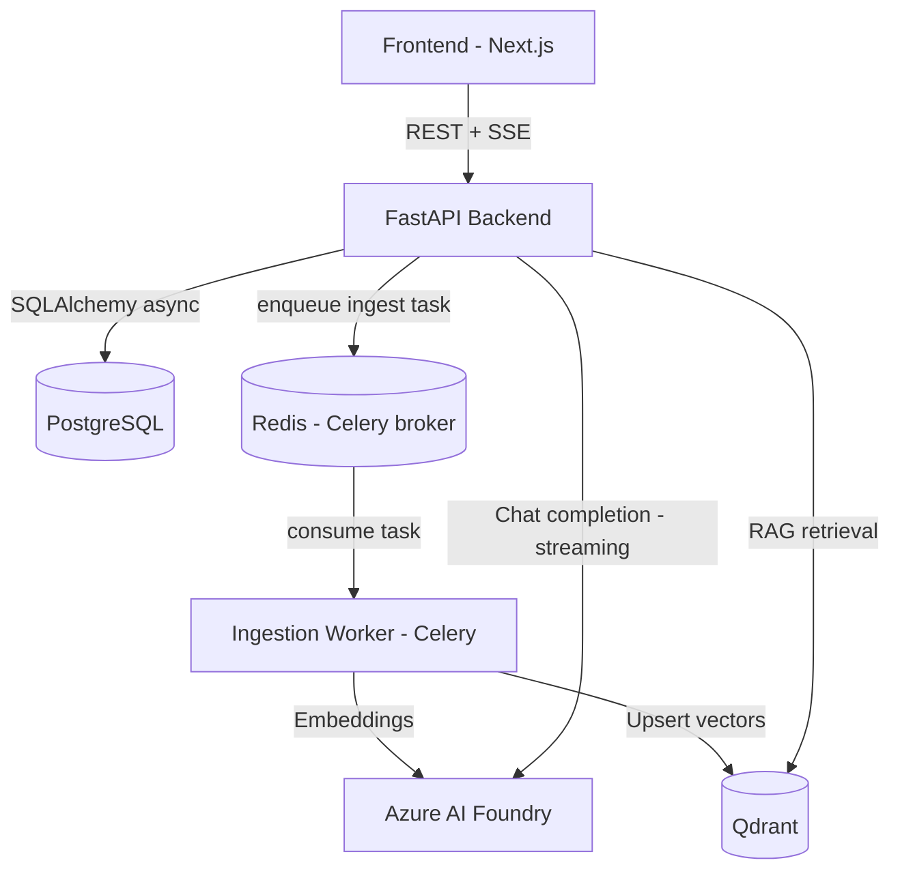

# AgenticMesh - Distributed Enterprise AI Agent & RAG Platform

[](LICENSE)
[](https://www.python.org/)
[](https://nextjs.org/)
[](https://fastapi.tiangolo.com/)
[](https://www.docker.com/)

**AgenticMesh** é um ecossistema distribuído de alta resiliência projetado para orquestrar Agentes de IA autônomos e pipelines de RAG (Retrieval-Augmented Generation) em escala enterprise.

A plataforma conta com uma interface moderna em **Next.js** e um backend totalmente construído em **Python (FastAPI)**, usando o **Azure AI Foundry** (endpoint compatível com OpenAI, via SDK `openai`) como provedor de modelos de chat (Responses API) e embeddings, com controle de latência e observabilidade básica de execuções.

> **Status:** implementação inicial funcional (MVP) — ver [Escopo desta versão](#-escopo-desta-versão-mvp) abaixo para o que já funciona de ponta a ponta vs. o que é visão futura.

---

## 🏛️ Arquitetura do Sistema

O sistema é dividido em uma camada de frontend reativa em Next.js e serviços Python (API + worker assíncrono), todos orquestrados via Docker Compose.



---

## 🚀 Principais Módulos e Funcionalidades

### 1. Frontend Web App (`frontend/`)
* Next.js 14 (App Router, TypeScript, Tailwind CSS): login/registro, chat com streaming (SSE) e toggle de RAG, upload e listagem de documentos com status de processamento.

### 2. API (`backend/app/api`)
* FastAPI assíncrona: autenticação JWT, upload de documentos, endpoints de chat/agent (streaming e histórico).

### 3. RAG & Vector Processing Worker (`backend/app/workers`)
* Celery worker: extração de texto (txt/md/pdf), chunking, geração de embeddings via Azure AI Foundry e upsert no Qdrant.

### 4. Agent Core Engine (`backend/app/agents`)
* `RAGChatAgent`: agente único de retrieval-augmented chat (busca no Qdrant + geração via Azure AI Foundry, streaming token a token). Estruturado para permitir a introdução futura de um framework de orquestração multi-agente (LangGraph/Semantic Kernel) sem reescrita.

---

## 🛠️ Tech Stack

* **Frontend:** Next.js 14 (React 18, TypeScript, Tailwind CSS)
* **Backend Runtime:** Python 3.11+
* **Web Framework:** FastAPI + Uvicorn
* **AI:** Azure AI Foundry — endpoint compatível com OpenAI (chat via Responses API + embeddings via SDK `openai`)
* **Vector Database:** Qdrant
* **Task Queue:** Celery + Redis
* **Database & Cache:** PostgreSQL, Redis
* **Infraestrutura:** Docker, Docker Compose

### Escopo desta versão (MVP)

Simplificações deliberadas em relação à visão de longo prazo do projeto:
* Orquestração de agente é uma classe Python simples (`RAGChatAgent`), não LangGraph/Semantic Kernel.
* Sem RabbitMQ — Redis cobre broker do Celery e cache.
* Sem Alembic — tabelas criadas via `SQLAlchemy.metadata.create_all()` no boot do backend.
* Sem Kubernetes/Terraform — apenas Docker Compose.

---

## 📂 Estrutura do Repositório

```text
agentic-mesh/
├── docs/                       # Diagramas e documentação de arquitetura (futuro)
├── docker/
│   └── docker-compose.yml      # postgres, redis, qdrant, backend, worker, frontend
├── frontend/                   # App Next.js (chat / documentos / auth)
│   ├── src/
│   │   ├── app/                # App Router (login, chat, documents)
│   │   ├── components/         # Componentes React
│   │   ├── services/           # Cliente API (fetch + parser SSE manual)
│   │   └── types/
│   ├── package.json
│   └── tsconfig.json
├── backend/                    # Backend Python (FastAPI + Celery)
│   ├── app/
│   │   ├── api/v1/routes/      # auth, documents, agent, health
│   │   ├── core/                # config, security (JWT), db (SQLAlchemy async)
│   │   ├── models/              # User, Document, ChatSession, ChatMessage, AgentRun
│   │   ├── schemas/             # Pydantic request/response models
│   │   ├── services/            # azure_ai.py, vector_store.py (Qdrant), rag.py
│   │   ├── agents/              # RAGChatAgent
│   │   ├── workers/             # Celery app + ingest_document_task
│   │   └── main.py
│   └── requirements.txt
├── tests/backend/               # pytest suite
├── .env.example                 # copie para .env e preencha as credenciais
├── README.md
└── LICENSE
```

---

## ⚡ Como Executar Localmente

### Pré-requisitos
* Docker e Docker Compose.
* Um projeto no **Azure AI Foundry** com um deployment de chat (ex.: `gpt-4o-mini`) e um de embeddings (ex.: `text-embedding-3-small`).

### 1. Configurar variáveis de ambiente
```bash
cp .env.example .env
# edite .env e preencha:
#   AZURE_AI_FOUNDRY_ENDPOINT
#   AZURE_AI_FOUNDRY_API_KEY
#   AZURE_AI_FOUNDRY_CHAT_DEPLOYMENT
#   AZURE_AI_FOUNDRY_EMBEDDING_DEPLOYMENT
#   AZURE_AI_FOUNDRY_EMBEDDING_DIMENSIONS (deve bater com o modelo de embedding escolhido)
```

### 2. Subir tudo com Docker Compose
```bash
docker compose -f docker/docker-compose.yml up --build
```

Isso sobe: `postgres`, `redis`, `qdrant`, `backend` (FastAPI, :8000), `worker` (Celery) e `frontend` (Next.js, :3000).

Acesse o app em `http://localhost:3000` e a documentação interativa da API em `http://localhost:8000/docs`.

### Desenvolvimento sem Docker (opcional)
```bash
# Backend
cd backend
python -m venv .venv
source .venv/bin/activate  # Windows: .venv\Scripts\activate
pip install -r requirements-dev.txt
uvicorn app.main:app --reload --port 8000

# Worker (em outro terminal, mesmo venv)
celery -A app.workers.celery_app worker --loglevel=info

# Frontend (em outro terminal)
cd frontend
npm install
npm run dev
```

Nesse modo, suba pelo menos `postgres`, `redis` e `qdrant` via `docker compose -f docker/docker-compose.yml up postgres redis qdrant` e ajuste as URLs em `.env` para `localhost`.

### Rodando os testes
```bash
cd backend && pip install -r requirements-dev.txt
cd .. && pytest
```

---

## 📄 Exemplo de Uso das APIs (FastAPI)

### Registro e login
```http
POST /api/v1/auth/register
Content-Type: application/json

{ "email": "user@example.com", "password": "super-secret-123" }
```
Retorna `{ "access_token": "...", "token_type": "bearer" }`. Use esse token como `Authorization: Bearer <token>` nas chamadas abaixo.

### Ingestão de Documentos (RAG Pipeline)
```http
POST /api/v1/documents/ingest?category=architecture
Authorization: Bearer <token>
Content-Type: multipart/form-data

file: [arquivo.pdf]
```

### Consulta ao Agente via Stream SSE
```http
POST /api/v1/agent/stream
Authorization: Bearer <token>
Content-Type: application/json

{
  "prompt": "Analise a arquitetura do projeto e identifique potenciais gargalos de concorrência.",
  "enable_rag": true,
  "agent_type": "rag_chat"
}
```
Resposta em `text/event-stream`: eventos `{"type":"token","content":"..."}` token a token, seguidos de `{"type":"done","sources":[...]}`.

---

## 🤝 Contribuição

Contribuições são super bem-vindas! Sinta-se à vontade para abrir **Issues** ou enviar **Pull Requests**.

1. Faça o Fork do projeto
2. Crie sua Feature Branch (`git checkout -b feature/MinhaFeature`)
3. Commit suas mudanças (`git commit -m 'Add: nova funcionalidade'`)
4. Push para a Branch (`git push origin feature/MinhaFeature`)
5. Abra um Pull Request

---

## 📜 Licença

Distribuído sob a licença MIT. Veja `LICENSE` para mais informações.